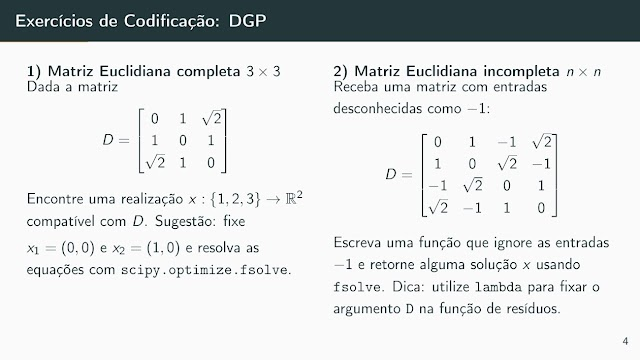
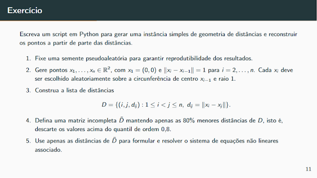

# Exercícios

Problemas propostos e resolvidos da disciplina.

---

## Exercícios de Codificação: DGP

### Exercício 1 — Matriz Euclidiana completa $3 \times 3$

Dada a matriz:

$$
D = \begin{bmatrix} 0 & 1 & \sqrt{2} \\ 1 & 0 & 1 \\ \sqrt{2} & 1 & 0 \end{bmatrix}
$$

Encontre uma realização $x : \{1, 2, 3\} \rightarrow \mathbb{R}^2$ compatível com $D$.

**Sugestão:** fixe $x_1 = (0,0)$ e $x_2 = (1,0)$ e resolva as equações com `scipy.optimize.fsolve`.

---

### Exercício 2 — Matriz Euclidiana incompleta $n \times n$

Receba uma matriz com entradas desconhecidas como $-1$:

$$
D = \begin{bmatrix} 0 & 1 & -1 & \sqrt{2} \\ 1 & 0 & \sqrt{2} & -1 \\ -1 & \sqrt{2} & 0 & 1 \\ \sqrt{2} & -1 & 1 & 0 \end{bmatrix}
$$

Escreva uma função que ignore as entradas $-1$ e retorne alguma solução $x$ usando `fsolve`.

**Dica:** utilize `lambda` para fixar o argumento $D$ na função de resíduos.

---

### Exercício 3 — Geração de instância e reconstrução

Escreva um script em Python para gerar uma instância simples de geometria de distâncias e reconstruir os pontos a partir de parte das distâncias.

1. Fixe uma semente pseudoaleatória para garantir reprodutibilidade dos resultados
2. Gere pontos $x_1, \ldots, x_n \in \mathbb{R}^2$, com $x_1 = (0,0)$ e $\|x_i - x_{i-1}\| = 1$ para $i = 2, \ldots, n$. Cada $x_i$ deve ser escolhido aleatoriamente sobre a circunferência de centro $x_{i-1}$ e raio 1
3. Construa a lista de distâncias:

$$D = \{(i, j, d_{ij}) : 1 \leq i < j \leq n, \ d_{ij} = \|x_i - x_j\|\}$$

4. Defina uma matriz incompleta $\hat{D}$ mantendo apenas as 80% menores distâncias de $D$, isto é, descarte os valores acima do quantil de ordem 0.8
5. Use apenas as distâncias de $\hat{D}$ para formular e resolver o sistema de equações não lineares associado
