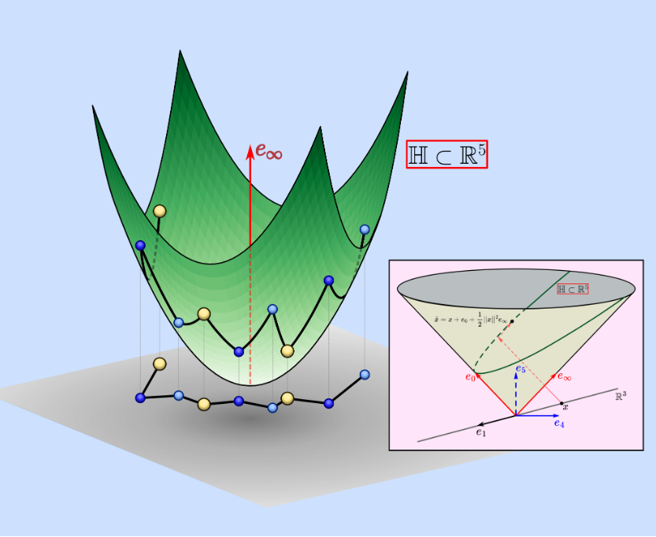

# DGP Wiki — MS500 UNICAMP 2026

{ width="600" }

Bem-vindo à wiki da disciplina **MS500 — Geometria de Distâncias: Teoria e Aplicações**.

Ministrada pelos professores **Carlile Campos Lavor** (IMECC/UNICAMP) e **Michael Souza**, esta disciplina aborda o Distance Geometry Problem (DGP) com foco em teoria e aplicações computacionais.

## Navegação

Utilize as abas no topo para acessar os conteúdos:

- **Introdução** — Fundamentos, modelagem e algoritmos do DGP
- **Revisão Biologia** — Aminoácidos, proteínas e ligações peptídicas
- **Aplicações** — Aplicações em biologia molecular, NMR, redes de sensores
- **Artigo** — Análise de artigos de referência
- **Exercícios** — Problemas propostos e resolvidos
- **Professores** — Informações sobre os docentes
